# furble UI walkthrough

This is a screen by screen tour of the furble interface. Every screenshot is a
real render from the furble SDL simulator, which runs the shipping UI code over
a modeled M5StickS3 (135x240) panel. Where a page depends on hardware the
simulator does not model, the page is described in words and the reason is
noted.

This document shows what each page looks like and how you reach it. For the
exhaustive per setting tables (default, values, when a change applies, board
gating), see the companion reference:
[settings and controls](settings-and-controls.md).

## How to read this tour

- Screenshots are the M5StickS3 135x240 board class, default theme, unless a
  section says otherwise.
- "Focus" is the highlighted item. The blue bar (default theme) or green
  outline (dark theme) marks it.
- Navigation is described with the three logical inputs: previous, select, next.
  See [Controls](#controls) for how those map to real buttons on each board.
- Some settings pages are longer than the screen and scroll. For those the tour
  shows the top of the page and then a strip of the lower rows, so every option
  is pictured. Narrower boards show fewer rows per screen, so the same page takes
  more scrolling there.

## Controls

furble drives the whole interface with three logical inputs. They map to real
buttons per board.

| Board family | Previous / Back | Select / Shutter | Next / Focus |
| :--- | :--- | :--- | :--- |
| M5StickC, StickC Plus | Power (PEK) button | BtnA (front) | BtnB (top) |
| M5StickC Plus2, StickS3 | Side power button | BtnA (front) | BtnB (top) |
| M5Stack Core, Core2, Tough | BtnA (left) | BtnB (middle) | BtnC (right) |

Two-button navigation is the default and only navigation model:

- Previous (left) moves focus to the previous item. A long press, about 0.8 s,
  is Back from anywhere. On the shutter page a short press is also Back.
- Select (middle) activates the focused item. On the shutter page it fires the
  shutter.
- Next (right) moves focus to the next item. On the shutter page it holds focus.

One-button mode is a shipped, opt-in alternative that changes only the shutter
page. Set it under `Settings` > `Features` > `Button Mode`. The full input model,
including the one-button gestures and shutter lock, is documented in
[Part 2 of the settings and controls reference](settings-and-controls.md#part-2-button-input-and-controls).

## Boot

On power up furble draws a boot splash with a progress bar while it brings up
each subsystem (Infrared, Feedback, Storage, Power, Bluetooth, Companion). The
splash is the shipped default and can be turned off under
`Settings` > `Features` > `Boot screen`. The splash is drawn directly to the
display before the LVGL interface takes over. The simulator snapshots it during
boot through a dedicated capture hook, before the main menu replaces it.

## Main menu

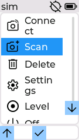

The main menu is the home screen. Its entries in order are:

- **Connect**: connect to a saved camera.
- **Scan**: search for a new camera to pair.
- **Delete**: remove a saved camera.
- **IR**: fire the camera over infrared. This entry appears only when the board
  has an IR LED and Infrared is enabled.
- **Settings**: the settings tree, described below.
- **Off**: power the device off.

The header shows the connection state and the battery indicator.

### Connect, Scan, Delete

These three entries open list pages driven by live Bluetooth activity. The
simulator seeds a saved camera and a fake scan, so each list renders with an
entry:

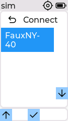
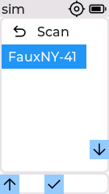
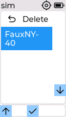

- **Connect** lists your saved cameras. Selecting one connects to it. With
  Multi-Connect enabled the list also carries a Multi-Connect action to bring up
  more than one camera.
- **Scan** searches for nearby cameras in pairing mode and shows them as they
  are found, with a scanning indicator. Selecting a found camera pairs and
  connects to it.
- **Delete** lists saved cameras so you can remove one.

The connecting overlay they lead to is shown next.

## Connecting

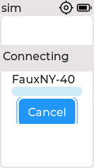

When you connect, furble shows a progress overlay naming the camera with a
Cancel button. Selecting Cancel aborts the attempt and returns to the menu. When
the link comes up the device moves to the Connected page.

## Connected

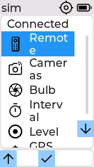

Once a camera is connected furble shows the Connected menu. Its entries in order
are:

- **Remote**: the shutter control page.
- **IR**: fire the shutter over infrared. Shown only when Infrared is supported
  and enabled.
- **Bulb**: a timed long exposure.
- **Interval**: the intervalometer, sharing the Timer configuration.
- **GPS Data**: the live GPS page.
- **Disconnect**: drop the camera and return to the main menu.

When the IMU setting is enabled, Connected also contains **Level**, a live
spirit-level view. Settings > Diagnostics contains **IMU**, which shows the
accelerometer sample and gyro state. Both pages use the physical sensor on
firmware and the deterministic IMU seam in the simulator.

### Remote

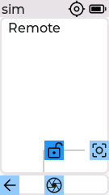

The Remote page is the shutter control. Select fires the shutter, Next
half-presses focus. Hold focus then press the shutter to lock the shutter open
for a long exposure. Leaving the page always releases the shutter. On Ricoh,
the Focus control remains visible in the generic UI but is a no-op: the BLE
protocol has no verified focus-only operation. The Ricoh shutter performs
capture with autofocus. On touch boards the on-screen Shutter, Focus, and
Shutter Lock buttons are always visible; the screenshot shows the button-board
indicators. A per-camera hide/disable treatment remains a UI follow-up.

### Bulb

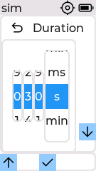

Bulb is a timed long exposure. Set the Duration with the spinner (value, then
unit: milliseconds, seconds, or minutes), press Start, and the shutter releases
when the timer reaches zero. The camera must be in its own bulb (B) mode. The
chosen duration is remembered for next time.

### Interval

Interval opens the same page as `Settings` > `Timer`, described under
[Timer](#timer). It runs the intervalometer with the stored Count, Delay,
Shutter, and Wait values. Press Start to run and Stop to end early.

### GPS Data

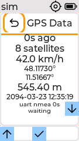

The GPS Data page shows the live fix: age, satellite count, speed, latitude and
longitude, altitude, and UTC date and time. It is reachable both here and under
`Settings` > `GPS` > `GPS Data`.

Below the fix, two smaller rows report the receiver itself, so a receiver that
is alive but not fixing reads differently from one that has gone quiet:

| Row | Reads |
| :--- | :--- |
| `uart nmea 3s` | Where the fix came from (`uart`, `comp` for a companion phone, or `none`), and how long ago the receiver last sent a sentence. `nmea n/a` means nothing has arrived yet. The age switches to whole minutes past 99 s and stops at `99m+`, so the row keeps its width however long a receiver stays quiet. |
| `waiting` | The receiver power cycle state: `disabled`, `acquiring`, `measuring`, `burst`, `waiting`, `standby`, `rail_off`, `resync` or `degraded`. A degraded cycle appends its retry count, as `degraded x1`. |

The console prints the whole receiver state, not this two row summary. `gps
status` adds the fix source, power cycle state, power policy, standby interval,
configured fix interval, sentence age in milliseconds, and the assisted start
mode and cache state.

The rows are short on purpose. On the Stick boards the right hand navigation
indicator floats over the bottom of the page, and a wider row would run
underneath it. For the same reason the date and time share one row here, as they
already did on the 320x240 Core.

The 80x160 M5StickC does not show these rows. That panel has no room left on the
page, and the page carries no focusable control for the buttons to scroll it
with, so the rows would render below the fold with no way to reach them. Raw
NMEA carries the HDOP, degraded state, and receiver counters on that board.

## Settings

The Settings menu groups every option. Its entries in order are Display,
Features, Infrared, GPS, Timer, Theme, Text size, Bluetooth, About, Power,
Feedback, Diagnostics, Storage. Infrared, Feedback, and Storage appear only on
boards with the matching hardware.

The list is longer than the screen. The image above is the top; scrolling down
reveals the rest:

| | |
| :--- | :--- |
| 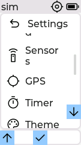 | 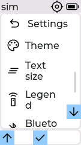 |

### Display

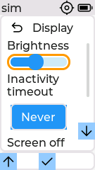

- **Brightness**: screen brightness slider with a live preview.
- **Inactivity timeout**: dim then sleep the screen after an idle period.
- **Screen off**: what the inactivity timeout does (Dim, Off, or Off with the
  remote still active on button boards).
- **Calibrate**: touch calibration. Touch boards only.
- **Show Title**: show or hide the window title in the header.

### Features

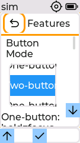

Button Mode picks two-button or one-button shutter control, with a gesture hint
below the roller. The switches below it are Auto-Connect, FauxNY (a fake test
camera for development), Infinite-ReConnect, Reconnect Backoff, Multi-Connect,
Companion (the companion BLE service), Watchdog (M5StickS3 only), Preset Picker
(the exposure preset stepper on the shutter page), and Boot screen (the startup
splash).

Features is the longest settings page. The image above is the top; these frames
scroll down through every switch:

| | | |
| :--- | :--- | :--- |
| 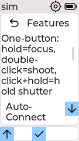 | 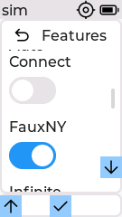 | 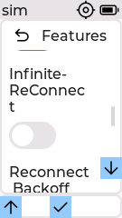 |

### Companion pairing

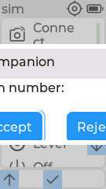

With the Companion service enabled, a companion app that connects raises a pairing
dialog showing a PIN with Accept and Reject buttons. Confirming pairs the app;
rejecting dismisses it. The simulator injects a pending pairing so the dialog
renders without a companion peer.

### Infrared

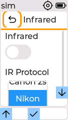

The Infrared submenu holds the Infrared on/off switch and the IR Protocol roller
(Nikon, Sony, Canon, Canon 2s). The whole submenu is hidden unless the board has
an IR LED. The simulator reports an IR LED present (behind a capture flag) so the
submenu renders; see the
[settings reference](settings-and-controls.md#infrared) for the values.

### GPS

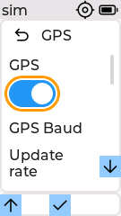

The GPS switch is the master control. When it is on, the receiver configuration
rows appear: baud (9600 or 115200), Update rate, Sentences, Constellation, a
Power saving submenu, Assisted start, Fix Hold, Extrapolate, and the two live
pages GPS Data and Raw NMEA. When GPS is off, only the switch is shown.
Extrapolate is greyed out until Fix Hold is set, because it has nothing to
project without a held fix.

With GPS on the list runs past the screen. Scrolling down shows the lower rows:

| |
| :--- |
| 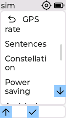 |

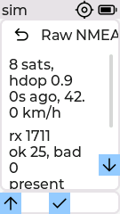

Raw NMEA shows the sentences arriving from the receiver, the fix state, and error
counters, with a Hot restart button.

### Timer

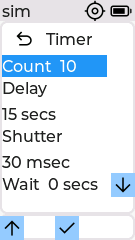

The Timer submenu is the intervalometer configuration. Count is the number of
frames, Delay is the time between frames, Shutter is how long the shutter is held
per frame, and Wait is the initial delay before the first frame. A Start button
runs the sequence. Each value is set with a spinner (value plus a unit of ms, s,
or min).

### Theme

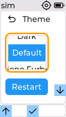

Pick Dark, Default, or Mono Furble, then press the Restart button to save and
apply.

### Text size

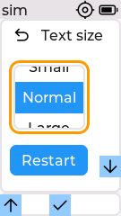

Pick Small, Normal, or Large, then press Restart to apply. The setting swaps the
UI font, so menu rows, label:value pages, and the connected view all grow or
shrink together. The gallery below shows the same three pages at each size on the
M5StickS3 (135x240) Default theme.

| Small | Normal | Large |
| :--- | :--- | :--- |
| 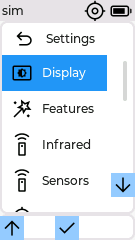 | 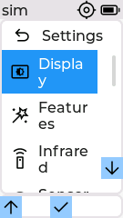 | 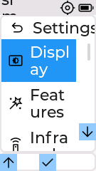 |
| 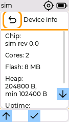 | 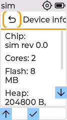 | 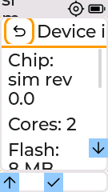 |
| 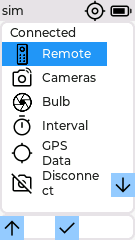 | 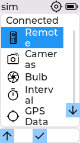 | 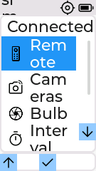 |

### Bluetooth

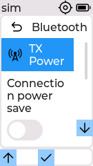

- **TX Power**: a submenu with an Adaptive switch and a transmit-power slider
  (P3, P6, P9).
- **Connection power save**: power save on the active connection.
- **Scan mode**: how hard the radio listens during Scan (Full, Balanced, Low).
- **Scan timeout**: end a scan by itself after a chosen time.

The list runs slightly past the screen. Scrolling down shows the last row:

| |
| :--- |
| 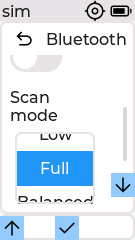 |

### About

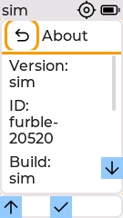

A read-only page: firmware version, device ID, build date, IDF version, uptime,
free heap, and reset reason. It scrolls; these frames show the lower rows:

Development firmware shows `dev+g<revision>` and appends `.dirty` for a dirty
checkout. Explicit release versions are shown unchanged.

| | |
| :--- | :--- |
| 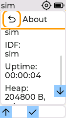 | 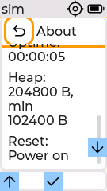 |

### Power

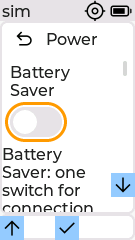

- **Sleep while connected**: doze between BLE events while connected. M5StickS3
  only.
- **CPU speed**: 80, 160, or 240 MHz.
- **Battery Style**: what the header battery indicator shows (Icon, Percent,
  Both).
- **Auto off**: power off after an idle period. Not on M5Stack Core Basic.
- **Low battery**: what to do on low battery. Not on M5Stack Core Basic.
- **Battery**: a live battery detail page (below).

Power is a long page. The image above is the top; these frames scroll down
through the rest of the rows to the Battery entry:

| | | | |
| :--- | :--- | :--- | :--- |
| 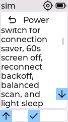 | 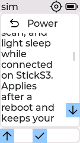 | 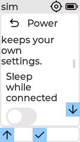 | 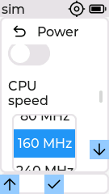 |

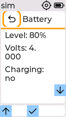

The Battery page shows charge level, voltage, current, charging state, and a
runtime estimate. Rows the board cannot measure are hidden.

### Feedback

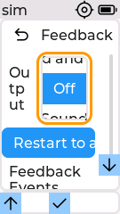

The Feedback submenu picks an Output (Off, Sound, Light, Vibrate, or a
combination, filtered to what the board supports), a per-event mask (Shutter
fired, Countdown, Connect and disconnect, Low battery), and a Volume slider when
the chosen output includes sound. The submenu is skipped on boards with no output
beyond Off. The simulator reports the full output set (behind a capture flag) so
the submenu renders; see the [settings reference](settings-and-controls.md#feedback).

### Diagnostics

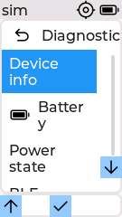

Diagnostics groups read-only status pages.

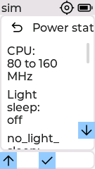
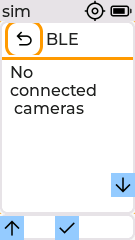

- **Device info**: chip, cores, flash, heap, uptime, reset reason.
- **Battery**: the same page linked from Power.
- **Power state**: clock frequency, sleep, power-lock rows, tickless idle, and a
  Dump locks button.
- **BLE**: a live BLE status row.

### Sensors

The Sensors page contains the **IMU** switch. It is off by default and requires
Restart after changing it. When enabled, the Connected menu exposes **Level**;
the live accelerometer page is also available under Diagnostics.

### Storage

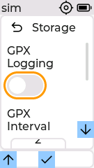

The Storage submenu holds GPX Logging on/off, a GPX Interval roller, Export and
Import Settings actions, and a Card Info page. It appears only on boards with a
supported SD card slot. The simulator reports a mounted card (behind a capture
flag) so the submenu renders; see the
[settings reference](settings-and-controls.md#storage).

The submenu scrolls; these frames show the lower rows:

| | |
| :--- | :--- |
| 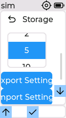 |  |

## Dark theme

The Dark theme swaps the light background for a dark one and marks focus with a
green outline. Set it under `Settings` > `Theme` > `Dark` and press Restart.

The same long settings pages scroll in the Dark theme. Each strip below runs from
just below the top of the page down to its last row:

Settings root:

| | |
| :--- | :--- |
|  |  |

Features:

| | | |
| :--- | :--- | :--- |
|  |  |  |

GPS and Bluetooth:

| | |
| :--- | :--- |
|  |  |

About:

| | |
| :--- | :--- |
|  |  |

Power:

| | | | |
| :--- | :--- | :--- | :--- |
|  |  |  |  |

Storage:

| | |
| :--- | :--- |
|  |  |

## Panels and themes

furble ships three themes (Default, Dark, Mono Furble) and runs on three panel
classes. The simulator renders each at its native resolution. This gallery is a
representative sample of the boards x themes matrix; the full per page capture for
every cell lives under `docs/img/<board>/<theme>/`. The narrow Stick panels use
the non-touch layout (physical L / OK / R button indicators are always on
screen); the Core is a touch panel and shows the on-screen touch controls.

### M5StickS3, M5StickC-Plus (135x240)

| Default | Dark | Mono Furble |
| :--- | :--- | :--- |
|  |  |  |
|  |  |  |
|  |  |  |

### M5StickC (80x160)

| Default | Dark | Mono Furble |
| :--- | :--- | :--- |
|  |  |  |
|  |  |  |
|  |  |  |

### M5Stack Core, Core2 (320x240)

| Default | Dark | Mono Furble |
| :--- | :--- | :--- |
|  |  |  |
|  |  |  |
|  |  |  |

## Level and IMU diagnostics

Enable `Settings` > `Sensors` > `IMU`, then press the Sensors page's Restart
button. The setting is off by default. After restart, **Level** appears in
Connected and **IMU** appears under Settings > Diagnostics. The level follows
roll and pitch and rotates to the side-bubble view when the device is laid over.

The level page shows a bubble that tracks device tilt. Holding the device level
centers the bubble; tilting moves it off center along the side tube. The IMU
diagnostics page shows the raw acceleration readout. Simulator scenarios cover
both orientations and all supported panel sizes; physical axis/sign and rotated
DMA behavior remain hardware checks.

## What the simulator models

The screenshots come from the SDL simulator, which runs the real UI code over the
modeled M5StickC, M5StickS3, and M5Stack Core panels. The simulator now models
the pages that used to be described in words only:

- **Boot splash**: captured through a dedicated hook that snapshots the splash
  before the LVGL UI replaces it (`FURBLE_SIM_CAPTURE_SPLASH`).
- **Scan, Connect, and Delete list pages**: a seeded saved camera and a fake scan
  populate the lists so they render with entries.
- **Infrared, Feedback, and Storage submenus**: the sim reports an IR LED, a
  feedback output, and a mounted SD card (behind the `FURBLE_SIM_IR`,
  `FURBLE_SIM_FEEDBACK`, and `FURBLE_SIM_SD` capture flags) so the submenus
  render. These flags are sim only and never change the on-device hardware
  detection.

- **Scroll strips for long pages**: pages taller than the panel are captured
  frame by frame with the sim scroll action, so the walkthrough pictures every
  row and not just the top (`sim/scripts/docs-scroll.txt`, output under
  `docs/img/scroll/<theme>/`).

To regenerate the whole matrix, build the simulator (see `sim/CLAUDE.md`) and run
`sim/scripts/docs-capture.sh`, which rebuilds the sim once per panel class and
drives the capture scenarios for each theme with every optional feature enabled.
The single-board default and dark sets come from `sim/scripts/docs-screenshots.txt`
and `sim/scripts/docs-screenshots-dark.txt`, and the scroll strips from
`sim/scripts/docs-scroll.txt`.
