# furble UI walkthrough

This is a screen by screen tour of the furble interface. Every screenshot is a
real render from the furble SDL simulator, which runs the shipping UI code over
a modeled M5StickS3 (135x240) panel. Where a page depends on hardware the
simulator does not model, the page is described in words and the reason is
noted.

This document shows what each page looks like and how you reach it. For the
exhaustive per setting tables (default, values, when a change applies, board
gating), see the companion reference:
[settings and controls](Settings-Reference).

## How to read this tour

- Screenshots are the M5StickS3 135x240 board class, default theme, unless a
  section says otherwise.
- "Focus" is the highlighted item. The blue bar (default theme) or green
  outline (dark theme) marks it.
- Navigation is described with the three logical inputs: previous, select, next.
  See [Controls](#controls) for how those map to real buttons on each board.

## Controls

furble drives the whole interface with three logical inputs. They map to real
buttons per board.

| Board family | Previous / Back | Select / Shutter | Next / Focus |
| :--- | :--- | :--- | :--- |
| M5StickC, StickC Plus | Power (PEK) button | BtnA (front) | BtnB (top) |
| M5StickC Plus2, StickS3 | Side power button | BtnA (front) | BtnB (top) |
| M5Stack Core, Core2, Tough | BtnA (left) | BtnB (middle) | BtnC (right) |

Two-button navigation is the default and only navigation model:

- Previous (left) moves focus to the previous item. A long press, about 0.8 s,
  is Back from anywhere. On the shutter page a short press is also Back.
- Select (middle) activates the focused item. On the shutter page it fires the
  shutter.
- Next (right) moves focus to the next item. On the shutter page it holds focus.

One-button mode is a shipped, opt-in alternative that changes only the shutter
page. Set it under `Settings` > `Features` > `Button Mode`. The full input model,
including the one-button gestures and shutter lock, is documented in
[Part 2 of the settings and controls reference](Settings-Reference#part-2-button-input-and-controls).

## Boot

On power up furble draws a boot splash with a progress bar while it brings up
each subsystem (Infrared, Feedback, Storage, Power, Bluetooth, Companion). The
splash is the shipped default and can be turned off under
`Settings` > `Features` > `Boot screen`. The splash is drawn directly to the
display before the LVGL interface takes over, so the simulator renders it during
boot but it is replaced by the main menu before a script can capture it. It has
no separate screenshot here.

## Main menu

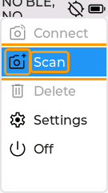

The main menu is the home screen. Its entries in order are:

- **Connect**: connect to a saved camera.
- **Scan**: search for a new camera to pair.
- **Delete**: remove a saved camera.
- **IR**: fire the camera over infrared. This entry appears only when the board
  has an IR LED and Infrared is enabled.
- **Settings**: the settings tree, described below.
- **Off**: power the device off.

The header shows the connection state and the battery indicator.

### Connect, Scan, Delete

These three entries open list pages driven by live Bluetooth activity:

- **Connect** lists your saved cameras. Selecting one connects to it. With
  Multi-Connect enabled the list also carries a Multi-Connect action to bring up
  more than one camera.
- **Scan** searches for nearby cameras in pairing mode and shows them as they
  are found, with a scanning indicator. Selecting a found camera pairs and
  connects to it.
- **Delete** lists saved cameras so you can remove one.

These pages are driven by real button presses into a scanning radio, which the
headless simulator does not exercise, so they have no captured screenshot here.
The connecting overlay they lead to is shown next.

## Connecting

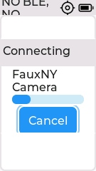

When you connect, furble shows a progress overlay naming the camera with a
Cancel button. Selecting Cancel aborts the attempt and returns to the menu. When
the link comes up the device moves to the Connected page.

### Camera pairing code

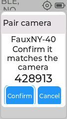

Some cameras request numeric-comparison pairing. furble shows the six-digit code
the camera generated in a modal before authorizing the link. Compare both
displays, then select **Confirm** only when they match. **Cancel** rejects the
request and drops the link. On the 80x160 M5StickC the two actions read **Yes**
and **No**, because the wider labels do not fit that panel.

A passkey-display request is the other direction: the code is furble's own
pairing passkey, which you type on the camera, and the modal offers Cancel only.
That passkey is fixed for the build, so a display request carries no
man-in-the-middle protection; the numeric comparison above does.

A prompt is answerable for 30 seconds, matching the Bluetooth Security Manager
timeout. After that it rejects itself and the connect fails, because an answer
the stack has already abandoned cannot complete the pairing. The screenshot is a
deterministic simulator render of the production modal; the real BLE exchange
still requires a camera that supports numeric comparison.

## Connected

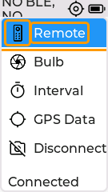

Once a camera is connected furble shows the Connected menu. Its entries in order
are:

- **Remote**: the shutter control page.
- **IR**: fire the shutter over infrared. Shown only when Infrared is supported
  and enabled.
- **Bulb**: a timed long exposure.
- **Interval**: the intervalometer, sharing the Timer configuration.
- **GPS Data**: the live GPS page.
- **Disconnect**: drop the camera and return to the main menu.

When enabled under Settings > Sensors, Connected includes the Level spirit-level
page and Diagnostics includes the live IMU readout. The simulator injects
deterministic samples through the same production sensor seam.

### Remote

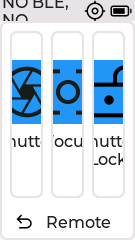

The Remote page is the shutter control. Select fires the shutter, Next
half-presses focus. Hold focus then press the shutter to lock the shutter open
for a long exposure. Leaving the page always releases the shutter. On Ricoh,
the Focus control remains visible in the generic UI but is a no-op: the BLE
protocol has no verified focus-only operation. The Ricoh shutter performs
capture with autofocus. On touch boards the on-screen Shutter, Focus, and
Shutter Lock buttons are always visible; the screenshot shows the button-board
indicators. A per-camera hide/disable treatment remains a UI follow-up.

### Bulb

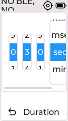

Bulb is a timed long exposure. Set the Duration with the spinner (value, then
unit: milliseconds, seconds, or minutes), press Start, and the shutter releases
when the timer reaches zero. The camera must be in its own bulb (B) mode. The
chosen duration is remembered for next time.

### Interval

Interval opens the same page as `Settings` > `Timer`, described under
[Timer](#timer). It runs the intervalometer with the stored Count, Delay,
Shutter, and Wait values. Press Start to run and Stop to end early.

### GPS Data

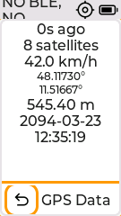

The GPS Data page shows the live fix: age, satellite count, speed, latitude and
longitude, altitude, and UTC date and time. It is reachable both here and under
`Settings` > `GPS` > `GPS Data`.

## Settings

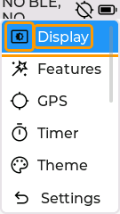

The Settings menu groups every option. Its entries in order are Display,
Features, Infrared, GPS, Timer, Theme, Text size, Bluetooth, About, Power,
Feedback, Diagnostics, Storage. Infrared, Feedback, and Storage appear only on
boards with the matching hardware.

### Display

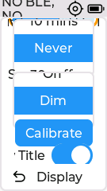

- **Brightness**: screen brightness slider with a live preview.
- **Inactivity timeout**: dim then sleep the screen after an idle period.
- **Screen off**: what the inactivity timeout does (Dim, Off, or Off with the
  remote still active on button boards).
- **Calibrate**: touch calibration. Touch boards only.
- **Show Title**: show or hide the window title in the header.

### Features

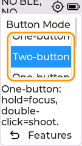

Button Mode picks two-button or one-button shutter control, with a gesture hint
below the roller. The switches below it are Auto-Connect, FauxNY (a fake test
camera for development), Infinite-ReConnect, Reconnect Backoff, Multi-Connect,
Companion (the companion BLE service), Watchdog (M5StickS3 only), Preset Picker
(the exposure preset stepper on the shutter page), and Boot screen (the startup
splash).

### Infrared

The Infrared submenu holds the Infrared on/off switch and the IR Protocol roller
(Nikon, Sony, Canon, Canon 2s). The whole submenu is hidden unless the board has
an IR LED. The simulator models a board without an active IR LED, so this page
has no captured screenshot; see the
[settings reference](Settings-Reference#infrared) for the values.

### GPS

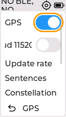

The GPS switch is the master control. When it is on, the receiver configuration
rows appear: baud (9600 or 115200), Update rate, Sentences, Constellation, a
Power saving submenu, Assisted start, and the two live pages GPS Data and Raw
NMEA. When GPS is off, only the switch is shown.

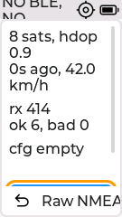

Raw NMEA shows the sentences arriving from the receiver, the fix state, and error
counters, with a Hot restart button.

### Timer

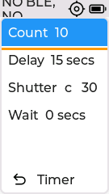

The Timer submenu is the intervalometer configuration. Count is the number of
frames, Delay is the time between frames, Shutter is how long the shutter is held
per frame, and Wait is the initial delay before the first frame. A Start button
runs the sequence. Each value is set with a spinner (value plus a unit of ms, s,
or min).

### Theme

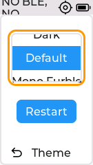

Pick Dark, Default, or Mono Furble, then press the Restart button to save and
apply.

### Text size

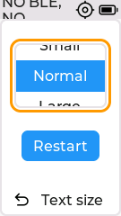

Pick Small, Normal, or Large, then press Restart to apply.

### Bluetooth

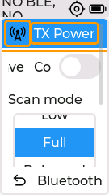

- **TX Power**: a submenu with an Adaptive switch and a transmit-power slider
  (P3, P6, P9).
- **Connection power save**: power save on the active connection.
- **Scan mode**: how hard the radio listens during Scan (Full, Balanced, Low).
- **Scan timeout**: end a scan by itself after a chosen time.

### About

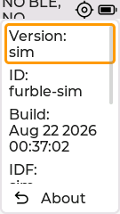

A read-only page: firmware version, device ID, build date, IDF version, uptime,
free heap, and reset reason.

Development firmware shows `dev+g<revision>` so a bench result can be tied to
its checked-out commit. Dirty checkouts append `.dirty`. Explicit release
versions are shown unchanged.

### Power

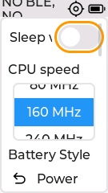

- **Sleep while connected**: doze between BLE events while connected. M5StickS3
  only.
- **CPU speed**: 80, 160, or 240 MHz.
- **Battery Style**: what the header battery indicator shows (Icon, Percent,
  Both).
- **Auto off**: power off after an idle period. Not on M5Stack Core Basic.
- **Low battery**: what to do on low battery. Not on M5Stack Core Basic.
- **Battery**: a live battery detail page (below).

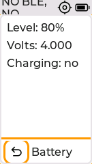

The Battery page shows charge level, voltage, current, charging state, and a
runtime estimate. Rows the board cannot measure are hidden.

### Feedback

The Feedback submenu picks an Output (Off, Sound, Light, Vibrate, or a
combination, filtered to what the board supports), a per-event mask (Shutter
fired, Countdown, Connect and disconnect, Low battery), and a Volume slider when
the chosen output includes sound. The submenu is skipped on boards with no output
beyond Off. The simulator models such a board, so this page has no captured
screenshot; see the [settings reference](Settings-Reference#feedback).

### Diagnostics

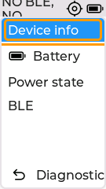

Diagnostics groups read-only status pages.

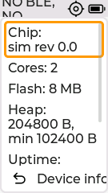
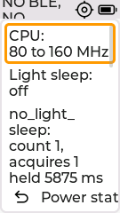
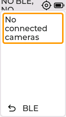

- **Device info**: chip, cores, flash, heap, uptime, reset reason.
- **Battery**: the same page linked from Power.
- **Power state**: clock frequency, sleep, power-lock rows, tickless idle, and a
  Dump locks button.
- **BLE**: a live BLE status row.

### Storage

The Storage submenu holds GPX Logging on/off, a GPX Interval roller, Export and
Import Settings actions, and a Card Info page. It appears only on boards with a
supported SD card slot. The simulator models a board without one, so this page
has no captured screenshot; see the
[settings reference](Settings-Reference#storage).

## Dark theme

The Dark theme swaps the light background for a dark one and marks focus with a
green outline. Set it under `Settings` > `Theme` > `Dark` and press Restart.

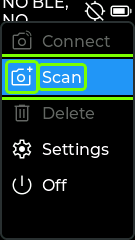
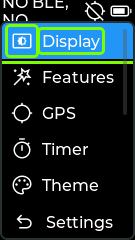
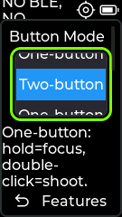
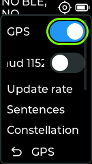
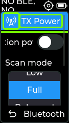
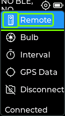
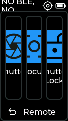

## What the simulator models

The screenshots come from the SDL simulator, which runs the real UI code over a
modeled M5StickS3 panel. A few things it does not model, and why they have no
screenshot:

- **Boot splash**: drawn to the display before the LVGL UI starts, so it is
  replaced by the main menu before capture.
- **Scan, Connect, and Delete list pages**: driven by real button presses into a
  live scanning radio, which the headless run does not exercise.
- **Infrared, Feedback, and Storage submenus**: gated on an IR LED, a real
  feedback output, and an SD card slot respectively. The modeled board reports
  none of these, so the submenus are hidden. They are documented from the
  firmware source in the [settings reference](Settings-Reference).

To regenerate the screenshots, build the simulator (see `sim/CLAUDE.md`) and run
`sim/scripts/docs-screenshots.txt` for the default theme and
`sim/scripts/docs-screenshots-dark.txt` (with `FURBLE_SIM_THEME=Dark`) for the
dark theme.
