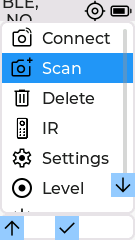
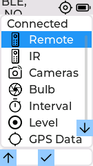
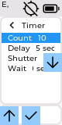
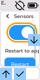
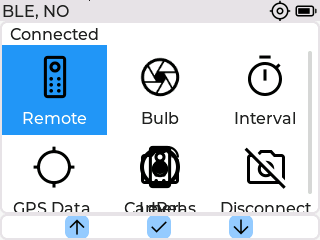

# 165 - the simulator measured a layout no modeled board ships

Every certified overflow assertion in the simulator measured the wrong layout,
on all three modeled boards.

`UI::begin()` picks the navigation layout at runtime from
`M5.Touch.isEnabled()`. A board with a touch panel gets the touch grid. A board
without one gets the physical-button layout: a navigation bar band at the bottom
of the window content, `ICON_HEADER_SIZE + 2` = 26 px tall, plus three button
indicators. On the Stick boards the switch on `M5.getBoard()` creates the three
buttons on `m_Screen` as floating children, so the band stays empty and is
purely the reserved clearance for the Left and OK indicators at the bottom edge.
On the Core the buttons live inside the band.

None of the three boards `sim/build.sh` models has a touch panel. The M5StickC,
the M5StickC Plus and the M5StickS3 have none. The M5Stack Core Basic has none
either: it has the three physical buttons A, B and C. Only the Core2 ships a
touch panel, and `sim/build.sh` does not model it. So the touch layout is the
one layout no modeled board renders.

The M5GFX SDL panel, however, always attaches a mouse-driven touch device, so
`M5.Touch.isEnabled()` was true for every modeled board in the simulator. The
non-touch layout was reachable only through `FURBLE_SIM_NO_TOUCH=1` or a
`no_touch` scenario seed, and no CI job set either. `sim/scripts/docs-capture.sh`
did set it per board for the screenshots, which is how the shipped layout stayed
in the documentation while no assertion ever measured it.

## Numbering

161 is `feat/sim-real-control-2` and 164 is the layout work of PR #263, both in
flight. 165 is the next free number.

## The full shipped-layout failure list

Measured on ab638874 by running each certified scenario with
`FURBLE_SIM_NO_TOUCH=1`. This is the worklist for the follow-up layout PR.

135x240, M5StickS3:

| Scenario | Failing page |
| --- | --- |
| `bughunt/page-matrix.txt` | `connected` |
| `bughunt/overflow-sweep.txt` | `connected` |
| `bughunt/text-size-overflow-large.txt` | `timer` at Large |
| `bughunt/text-size-overflow-small.txt` | `shutter` at Small |
| `e2e/home-seven-rows.txt` | `main`, seven rows |
| `e2e/home-seven-rows-large.txt` | `main`, seven rows at Large |
| `e2e/level-spirit.txt` | `level_surface_top` 69, not 50 |

80x160, M5StickC:

| Scenario | Failing page |
| --- | --- |
| `bughunt/page-matrix.txt` | `sensors` |
| `bughunt/overflow-sweep.txt` | `sensors` |
| `bughunt/text-size-overflow-large.txt` | `timer` at Large |
| `e2e/home-seven-rows-large.txt` | `main`, seven rows at Large |

320x240, M5Stack Core Basic:

| Scenario | Failing page |
| --- | --- |
| `bughunt/page-matrix.txt` | `connected` |

Twelve certified scenario runs in total. The `level-spirit` case is not an
overflow: the level page reserves the band, so its surface starts 19 px lower.
The Core's `overflow-sweep` reaches the connected page in a state that still
fits, so only its `page-matrix` run fails; the page itself overflows by 13 px in
the state `core-notouch-layout.txt` drives.

## Why the board default was not changed

Deriving the simulator default from the compiled board would turn all fourteen
of those runs red at once. Fixing the layouts is a hardware-verified change to
`src/FurbleUI.cpp` and is not this change. So this plan closes the measurement
gap and records the product gaps. The board-derived default is the last
follow-up, once the layouts are fixed.

## What this adds

Three scenarios, each certified for exactly one board:

| Scenario | Board |
| --- | --- |
| `bughunt/stick-notouch-layout-135.txt` | `m5stick-s3` |
| `bughunt/stick-notouch-layout-80.txt` | `m5stick-c` |
| `bughunt/core-notouch-layout.txt` | `m5stack-core` |

One file per board on purpose. The expectations are geometry, and a shared file
would have to soften every line to the weakest board, so a page that fits on two
boards would stop being asserted anywhere. Split this way, every page that fits
carries a hard `assert` and only the genuine per-board gaps are `xassert`, each
failing on the board it is written for. No line records an XPASS on any board,
so none of them needs the `xassert board-varies` opt-out plan 161 added: a
closed gap turns into an XPASS, fails the run, and forces the promotion to a
hard `assert` deliberately. That is the whole point of splitting the file.

The manifest already selects certified scenarios per board, so the existing
certified bug-hunt steps run all three with no new workflow job.
`tools/check_sim_scenarios.py` pins each board matrix in `EXACT_BOARDS` and the
`ir` capability in `WORKFLOW_CAPABILITIES`.

Each file starts with `assert ui.nav_layout buttons`. Without that guard a run
that lost the seed would fall back to the touch layout and pass for the wrong
reason, which is the exact failure this plan exists to remove.

Three simulator-only queries were added to `UI::simQueryState`:

- `ui.nav_layout`: `touch` or `buttons`.
- `ui.indicator_clearance`: `clear`, `overlap` or `n/a`.
- `ui.indicator_overlaps`: the count, for diagnosis.

The clearance query walks the current page for visible content widgets and
intersects them with the indicator rectangles. Labels, images, rollers,
switches, sliders, checkboxes and bars count; containers do not, because a flex
row spans the page by construction. Rollers matter as much as labels: the 80x160
timer rows are rollers, and a label-only query could not see the seconds values
the indicator covers.

Two corrections keep it meaningful rather than noisy. A label object is
stretched by its flex row while the glyphs occupy only part of it, so the box is
shrunk to the drawn text extent with the text alignment honoured. Without that,
every page carrying a full-width flex row at the indicator's height reports an
overlap, including pages whose text stops well short of it, and the reading is
noise. A scrolled page keeps coordinates for rows that are clipped away, so
every area is clamped to the page viewport first; without that, rows scrolled
out of sight are counted against the bottom indicators.

That clamp has a consequence worth stating plainly. The viewport ends above the
reserved band, so a clamped area can never reach the bottom-edge Left and OK
indicators. The query measures the indicators that float over content, which is
the Right one on the Sticks and none on the Core. It reports no result about the
bottom two rather than proving them clear.

## Measured gaps, recorded as xassert

Overflow. Every one of these fits on the touch layout the simulator was
measuring:

| Page | Board | Overflow |
| --- | --- | --- |
| `main`, seven rows | 135x240 | 21 px |
| `connected` | 135x240 | 25 px |
| `shutter` | 135x240 | 64 px |
| `sensors` | 80x160 | 10 px |
| `connected` | 320x240 | 13 px |

Content under an indicator. The Right indicator is at `LV_ALIGN_RIGHT_MID` with
a 65 px offset on the 135x240 panel, so a 24 px square at y 173 to 196, and with
no offset on the 80x160 panel, so a 24 px square at y 68 to 91, halfway down. The
Core has no floating indicator and is clear on every page.

| Page | Board | Widgets under an indicator |
| --- | --- | --- |
| `display` | 135x240 | 2 |
| `connected` | 135x240 | 1, the centred Disconnect row |
| `bulb_duration` | 135x240 | 1 |
| `display` | 80x160 | 1 |
| `bulb_duration` | 80x160 | 1 |
| `sensors` | 80x160 | 1 |
| `timer` | 80x160 | 2, the Delay and Shutter roller values |
| `bulb` | 80x160 | 1 |
| `timer_run` | 80x160 | 2 |

The 80x160 timer page is the clearest one: the indicator covers the second half
of the Delay and Shutter rows, so the seconds value is unreadable.

Plan 161 closed one of these while this branch was in review. With the
production `CameraList` behind the connected-session pages, the 80x160 camera
list no longer draws a row under the indicator, so that line was promoted from
`xassert` to a hard `assert`. It is the mechanism working as intended.

None of these were fixed here. Each is a change to the shipped layout on real
hardware and needs a hardware pass, and the Right indicator overlapping content
may be deliberate on the 135x240 panel, where it marks a physical button that
has nowhere else to go. The 80x160 timer case is not defensible and is the first
one to fix.

## What the gaps look like

Captured from the three scenarios with `capture`, at native panel size.

The 135x240 home menu with seven rows. Infrared, the seventh, is below the fold:
the reserved band leaves a 189 px page and the rows need 210.

The 135x240 connected page. It overflows by 25 px, and the centred Disconnect
row runs under the Right indicator.

The 80x160 timer page. The indicator covers the second half of the Delay and
Shutter rows, so the seconds values are unreadable. Those rows are rollers,
which is why the clearance query had to look past labels to find them.

The 80x160 sensors tile, overflowing by 10 px.

The 320x240 connected page on the Core Basic, overflowing by 13 px: the bottom
row of labels is clipped and Cameras collides with its own icon. This is the
board the first round of this work wrongly called unaffected.

## Known gap: the fuzzer still only fuzzes the touch layout

`sim/fuzz.cpp` checks a `layout-overflow` invariant, `mustFit(page)` against
`ui.overflow`, and `mustFit` covers `main`, `connected`, `shutter`, `bulb`,
`bulb_run`, `timer`, `timer_run` and `display`. Three of those, `main` with
seven rows, `connected` and `shutter`, are exactly the pages the shipped 135x240
layout overflows, and `connected` is the page the shipped 320x240 layout
overflows. A `FURBLE_SIM_NO_TOUCH=1` fuzz leg therefore cannot be added yet: run
on the 135x240 binary at 400 steps it exits non-zero with 274 `layout-overflow`
findings, all of them the same four known gaps rediscovered by a random walk.

Adding the leg is the natural second follow-up, after the overflow fixes and
before the board-derived default. Adding it now would mean either a red job or
an invariant weakened to hide the findings the new scenarios already record
precisely.

## Rebase onto plan 161

Plan 161 put the production `Control`, `Camera`, `CameraList` and `Scan` behind
the simulator, which changed two things here. The connect handshake is slower,
so `action connect` now needs `wait 3200` rather than `wait 1800`, matching the
timing re-derivation 161 applied to every other scenario. And the 80x160 camera
list overlap closed, as above.

The `bulb_duration` spin page overflows on every panel, 3 px at 135x240 and
320x240 and 55 px at 80x160. That is intentional scrolling, not a gap:
`page-matrix.txt` asserts its scroll extents rather than a fit, so these
scenarios assert only its indicator clearance.

## Implementation state

Implemented as described. `src/FurbleUI.cpp` gains the three queries and their
helper, all inside the existing `FURBLE_SIM` guard, plus two standard library
includes added inside that same guard. One comment was corrected: the home-row
padding arithmetic in `UI::addMenuItem` was written against the 215 px page of
the touch layout, and the shipped page is 189 px. The padding itself is
deliberately unchanged; that is the hardware-verified follow-up.

## Follow-ups

1. Fix the five overflow cases, then promote the five `xassert ui.overflow`
   lines. The failure list above is the worklist.
2. Fix the 80x160 indicator collisions, probably by reserving right padding on
   the Stick content area, then promote the remaining `xassert` lines.
3. Add the `FURBLE_SIM_NO_TOUCH=1` fuzz leg, which becomes green once 1 lands.
4. Derive the simulator default from the compiled board and delete the
   `no_touch` seed from these three scenarios. Every existing overflow scenario
   then measures the shipped layout automatically, and the three board-scoped
   files can fold back into the general sweeps.
